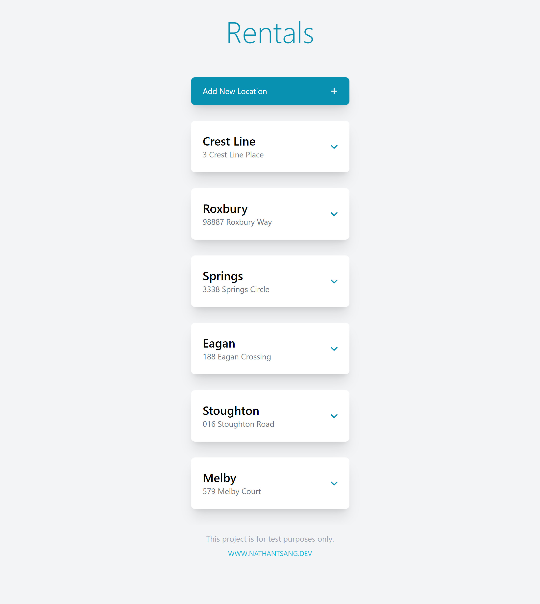
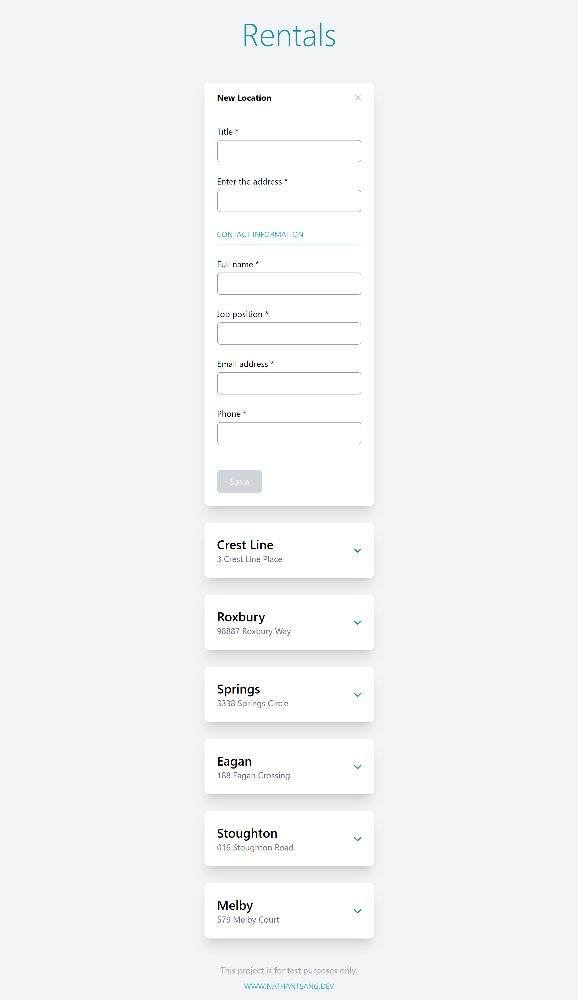
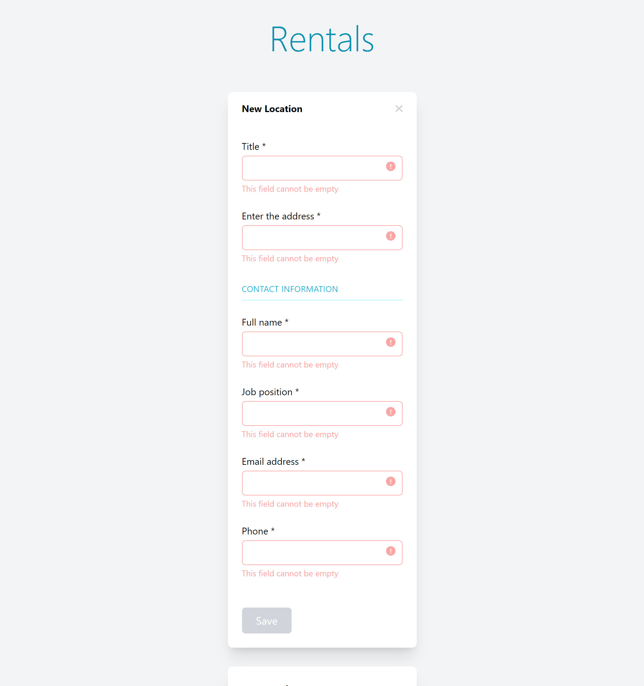
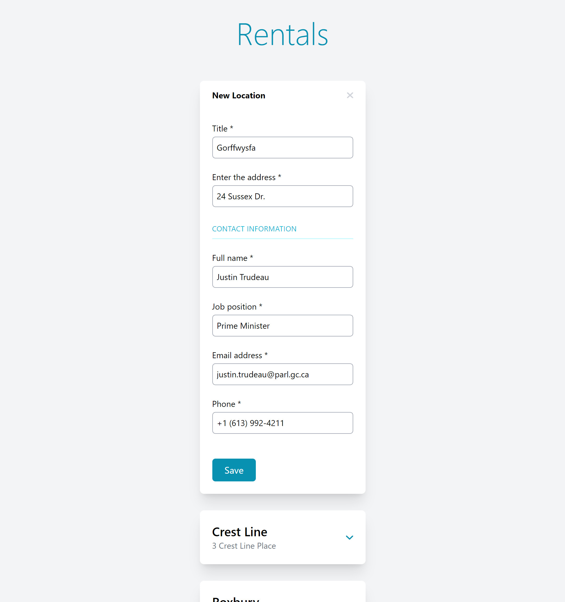
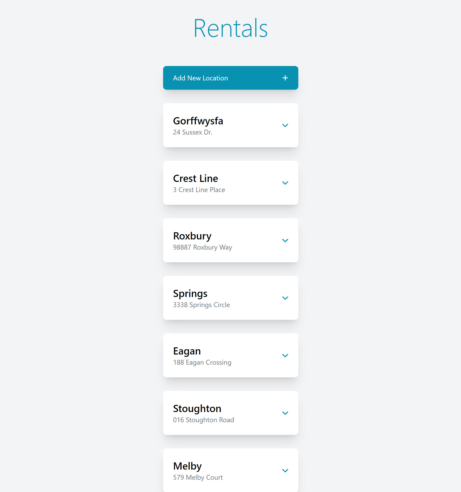
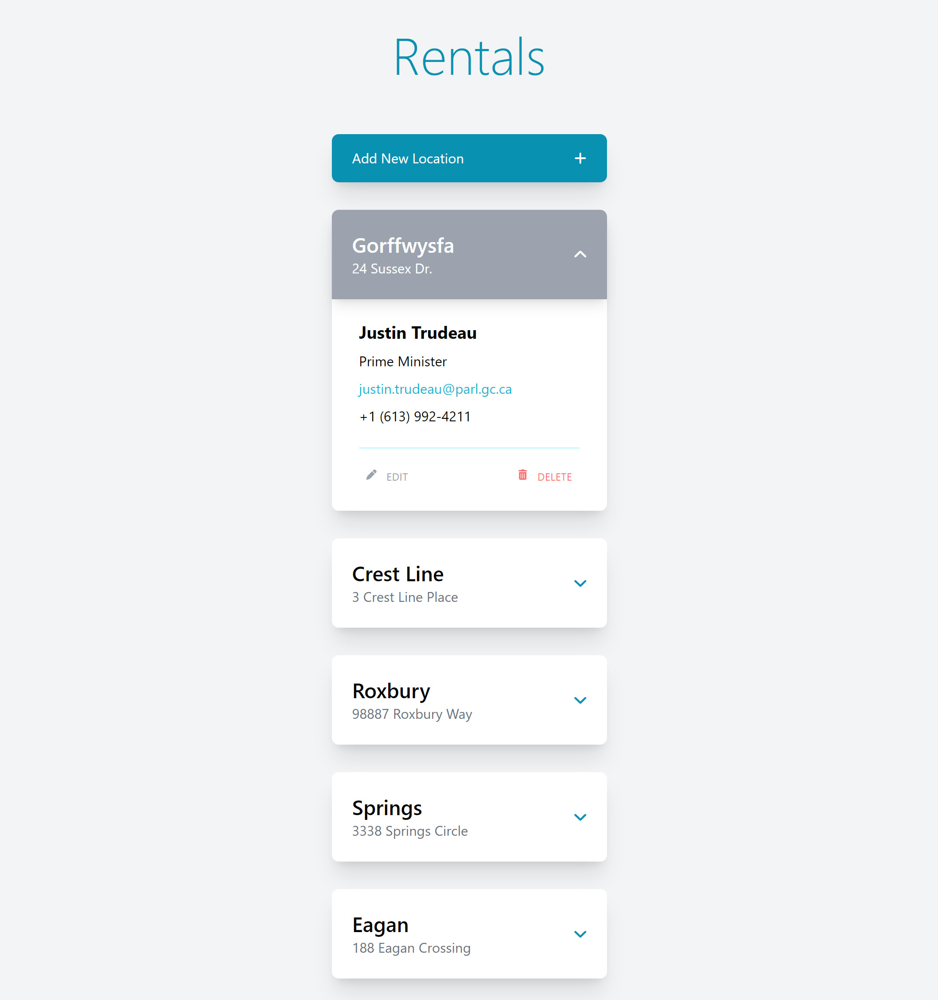
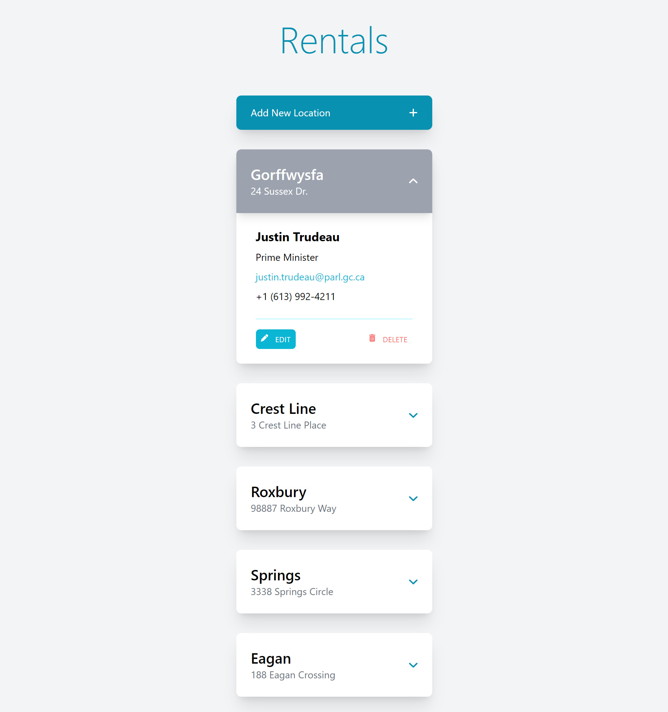
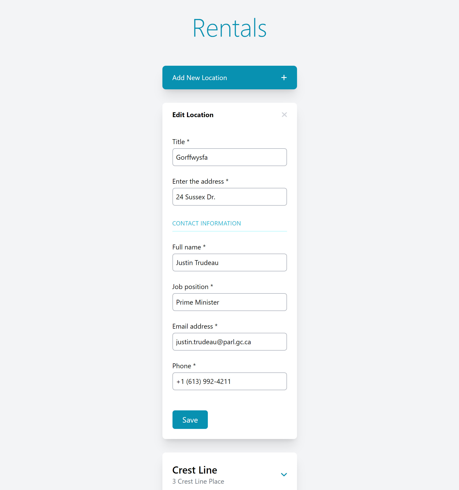
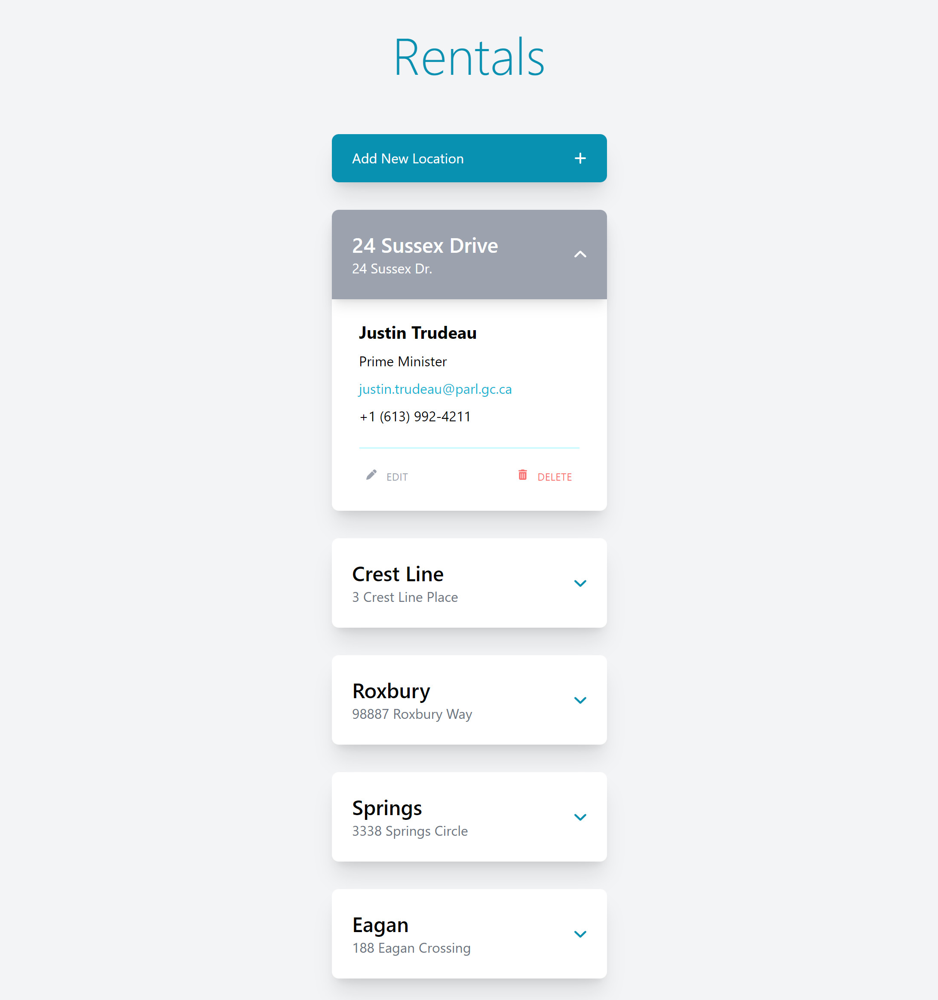
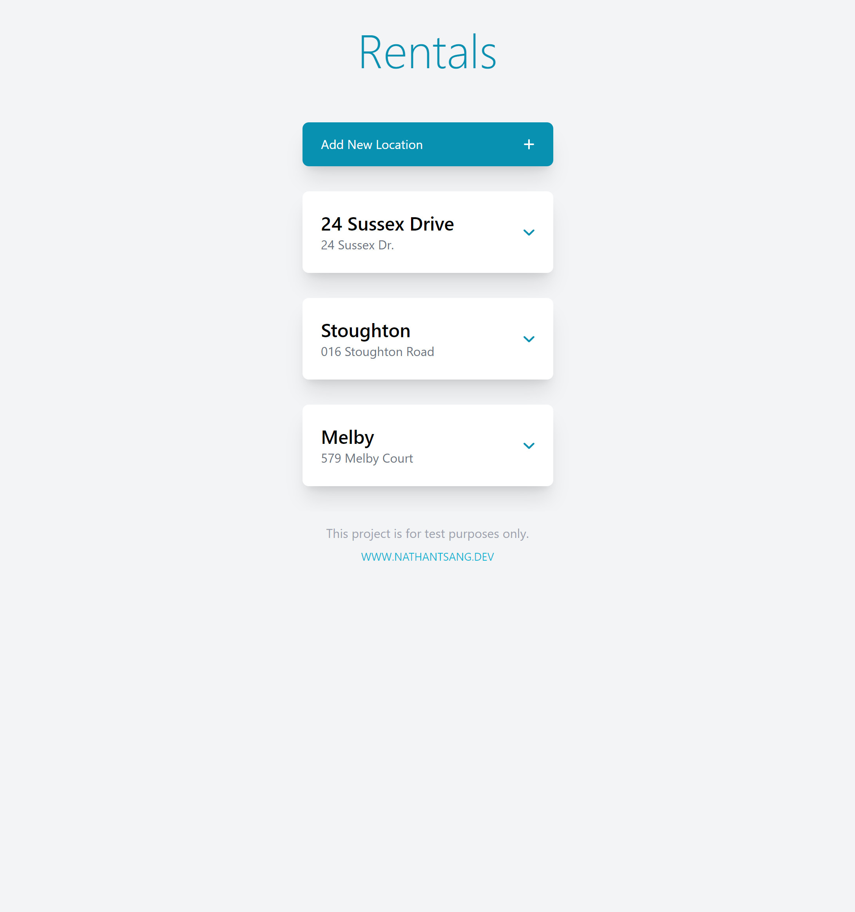

# Rental Property Tracker

Created by [@nathan-ts](https://github.com/nathan-ts).

## Purpose

To show and easily manage a list of rental properties and tenants. Uses mock data to seed the initial view. 

NB: This project was created as a tool to learn how to use Vue and SFCs. 

## Live Demo

Please visit [rental.nathantsang.dev](https://rental.nathantsang.dev/) for a live demo of the site.

## Project Setup Instructions

Node Version: [16](https://nodejs.org/dist/latest-v16.x/docs/api/)

Install dependencies: `npm i`

Run site in dev mode: `npm run dev`

Generate production build: `npm run generate`

## Screenshots

Home Screen

New Location

New Location, showing errors

New Location, completed

New Location added to home screen

Open Location

Open Location, showing hover on edit

Edit Location

Edit Location, saved

Deleted Locations

